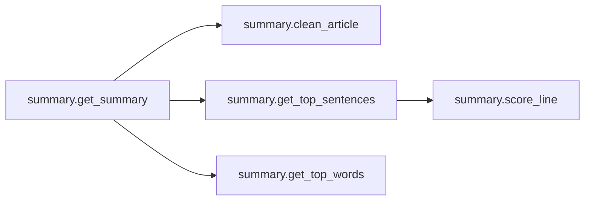
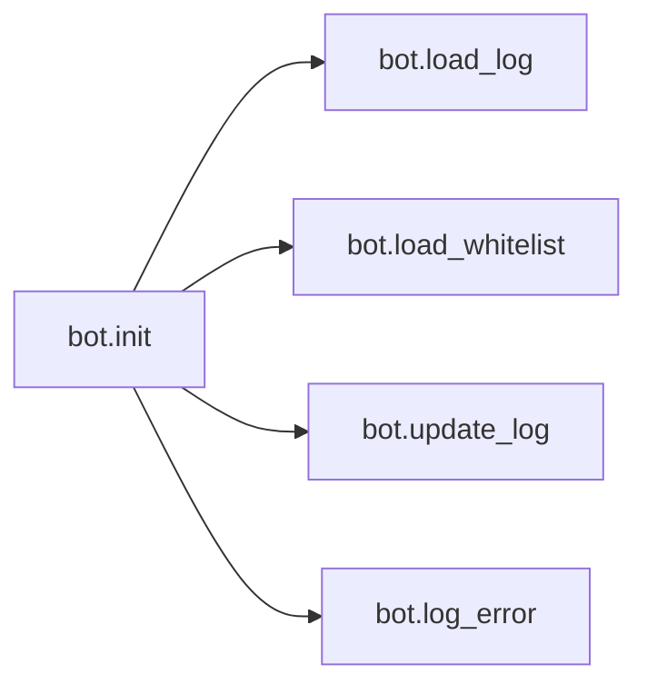
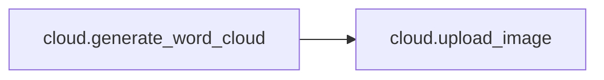
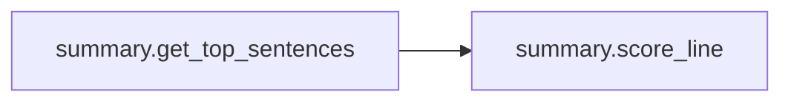

# Key Objects

[_Documentation generated by Documatic_](https://www.documatic.com)

<!---Documatic-section-summary.get_summary-start--->
## summary.get_summary

<!---Documatic-section-get_summary-start--->


### Object Calls

* summary.clean_article
* summary.get_top_sentences
* summary.get_top_words

<!---Documatic-block-summary.get_summary-start--->
<details>
	<summary><code>summary.get_summary</code> code snippet</summary>

```python
def get_summary(article):
    cleaned_article = clean_article(article)
    doc = NLP(cleaned_article)
    article_sentences = [sent for sent in doc.sents]
    words_of_interest = [token.text for token in doc if token.lower_ not in COMMON_WORDS]
    scored_words = Counter(words_of_interest)
    for word in scored_words:
        if word[0].isupper() and len(word) >= 4:
            scored_words[word] *= IMPORTANT_WORDS_MULTIPLIER
        if word.isdigit():
            scored_words[word] = 0
    top_sentences = get_top_sentences(article_sentences, scored_words)
    top_sentences_length = sum([len(sentence) for sentence in top_sentences])
    reduction = 100 - top_sentences_length / len(cleaned_article) * 100
    summary_dict = {'top_words': get_top_words(scored_words), 'top_sentences': top_sentences, 'reduction': reduction, 'article_words': ' '.join(words_of_interest)}
    return summary_dict
```
</details>
<!---Documatic-block-summary.get_summary-end--->
<!---Documatic-section-get_summary-end--->

# #
<!---Documatic-section-summary.get_summary-end--->

<!---Documatic-section-summary.score_line-start--->
## summary.score_line

<!---Documatic-section-score_line-start--->
<!---Documatic-block-summary.score_line-start--->
<details>
	<summary><code>summary.score_line</code> code snippet</summary>

```python
def score_line(line, scored_words):
    cleaned_line = [token.text for token in line if token.lower_ not in COMMON_WORDS]
    temp_score = 0
    for word in cleaned_line:
        temp_score += scored_words[word]
    line_lowercase = line.text.lower()
    for word in FINANCIAL_WORDS:
        if word in line_lowercase:
            temp_score *= FINANCIAL_SENTENCE_MULTIPLIER
            break
    return temp_score
```
</details>
<!---Documatic-block-summary.score_line-end--->
<!---Documatic-section-score_line-end--->

# #
<!---Documatic-section-summary.score_line-end--->

<!---Documatic-section-scraper.scrape_html-start--->
## scraper.scrape_html

<!---Documatic-section-scrape_html-start--->
<!---Documatic-block-scraper.scrape_html-start--->
<details>
	<summary><code>scraper.scrape_html</code> code snippet</summary>

```python
def scrape_html(html_source):
    for item in ['</p>', '</blockquote>', '</div>', '</h3>', '<br>']:
        html_source = html_source.replace(item, item + '\n')
    soup = BeautifulSoup(html_source, 'html5lib')
    article_title = soup.find('title').text.replace('\n', ' ').strip()
    if len(article_title) <= 5:
        article_title = soup.find('h1').text.replace('\n', ' ').strip()
    article_date = ''
    for item in soup.find_all('meta'):
        if 'time' in item.get('property', ''):
            clean_date = item['content'].split('+')[0].replace('Z', '')
            article_date = '{:%d-%m-%Y a las %H:%M:%S}'.format(datetime.fromisoformat(clean_date))
            break
    if len(article_date) <= 5:
        try:
            article_date = soup.find('time').text.strip()
        except:
            pass
    [tag.extract() for tag in soup.find_all(['script', 'img', 'ol', 'ul', 'time', 'h1', 'h2', 'h3', 'iframe', 'style', 'form', 'footer', 'figcaption'])]
    noisy_names = ['image', 'img', 'video', 'subheadline', 'editor', 'fondea', 'resumen', 'tags', 'sidebar', 'comment', 'entry-title', 'breaking_content', 'pie', 'tract', 'caption', 'tweet', 'expert', 'previous', 'next', 'compartir', 'rightbar', 'mas', 'copyright', 'instagram-media', 'cookie', 'paywall', 'mainlist', 'sitelist']
    for tag in soup.find_all('div'):
        try:
            tag_id = tag['id'].lower()
            for item in noisy_names:
                if item in tag_id:
                    tag.extract()
        except:
            pass
    for tag in soup.find_all(['div', 'p', 'blockquote']):
        try:
            tag_class = ''.join(tag['class']).lower()
            for item in noisy_names:
                if item in tag_class:
                    tag.extract()
        except:
            pass
    common_names = ['artic', 'summary', 'cont', 'note', 'cuerpo', 'body']
    article_body = ''
    for article_tag in soup.find_all('article'):
        if len(article_tag.text) >= len(article_body):
            article_body = article_tag.text
    if len(article_body) <= ARTICLE_MINIMUM_LENGTH:
        for tag in soup.find_all(['div', 'section']):
            try:
                tag_id = tag['id'].lower()
                for item in common_names:
                    if item in tag_id:
                        if len(tag.text) >= len(article_body):
                            article_body = tag.text
            except:
                pass
    if len(article_body) <= ARTICLE_MINIMUM_LENGTH:
        for tag in soup.find_all(['div', 'section']):
            try:
                tag_class = ''.join(tag['class']).lower()
                for item in common_names:
                    if item in tag_class:
                        if len(tag.text) >= len(article_body):
                            article_body = tag.text
            except:
                pass
    return (article_title, article_date, article_body)
```
</details>
<!---Documatic-block-scraper.scrape_html-end--->
<!---Documatic-section-scrape_html-end--->

# #
<!---Documatic-section-scraper.scrape_html-end--->

<!---Documatic-section-bot.init-start--->
## bot.init

<!---Documatic-section-init-start--->


### Object Calls

* bot.load_log
* bot.load_whitelist
* bot.update_log
* bot.log_error

<!---Documatic-block-bot.init-start--->
<details>
	<summary><code>bot.init</code> code snippet</summary>

```python
def init():
    reddit = praw.Reddit(client_id=config.APP_ID, client_secret=config.APP_SECRET, user_agent=config.USER_AGENT, username=config.REDDIT_USERNAME, password=config.REDDIT_PASSWORD)
    processed_posts = load_log()
    whitelist = load_whitelist()
    for subreddit in config.SUBREDDITS:
        for submission in reddit.subreddit(subreddit).new(limit=50):
            if submission.id not in processed_posts:
                clean_url = submission.url.replace('amp.', '')
                ext = tldextract.extract(clean_url)
                domain = '{}.{}'.format(ext.domain, ext.suffix)
                if domain in whitelist:
                    try:
                        with requests.get(clean_url, headers=HEADERS, timeout=10) as response:
                            if 'iso-8859-1' in response.text.lower():
                                response.encoding = 'iso-8859-1'
                            elif response.encoding == 'ISO-8859-1':
                                response.encoding = 'utf-8'
                            html_source = response.text
                        (article_title, article_date, article_body) = scraper.scrape_html(html_source)
                        summary_dict = summary.get_summary(article_body)
                    except Exception as e:
                        log_error('{},{}'.format(clean_url, e))
                        update_log(submission.id)
                        print('Failed:', submission.id)
                        continue
                    if summary_dict['reduction'] >= MINIMUM_REDUCTION_THRESHOLD and summary_dict['reduction'] <= MAXIMUM_REDUCTION_THRESHOLD:
                        image_url = cloud.generate_word_cloud(summary_dict['article_words'])
                        post_body = '\n\n'.join(['> ' + item for item in summary_dict['top_sentences']])
                        top_words = ''
                        for (index, word) in enumerate(summary_dict['top_words']):
                            top_words += '{}^#{} '.format(word, index + 1)
                        post_message = TEMPLATE.format(article_title, clean_url, summary_dict['reduction'], article_date, post_body, image_url, top_words)
                        reddit.submission(submission.id).reply(post_message)
                        update_log(submission.id)
                        print('Replied to:', submission.id)
                    else:
                        update_log(submission.id)
                        print('Skipped:', submission.id)
```
</details>
<!---Documatic-block-bot.init-end--->
<!---Documatic-section-init-end--->

# #
<!---Documatic-section-bot.init-end--->

<!---Documatic-section-cloud.upload_image-start--->
## cloud.upload_image

<!---Documatic-section-upload_image-start--->
<!---Documatic-block-cloud.upload_image-start--->
<details>
	<summary><code>cloud.upload_image</code> code snippet</summary>

```python
def upload_image(image_path):
    url = 'https://api.imgur.com/3/image'
    headers = {'Authorization': 'Client-ID ' + config.IMGUR_CLIENT_ID}
    files = {'image': open(IMAGE_PATH, 'rb')}
    with requests.post(url, headers=headers, files=files) as response:
        image_link = response.json()['data']['link']
        return image_link
```
</details>
<!---Documatic-block-cloud.upload_image-end--->
<!---Documatic-section-upload_image-end--->

# #
<!---Documatic-section-cloud.upload_image-end--->

<!---Documatic-section-summary.add_extra_words-start--->
## summary.add_extra_words

<!---Documatic-section-add_extra_words-start--->
<!---Documatic-block-summary.add_extra_words-start--->
<details>
	<summary><code>summary.add_extra_words</code> code snippet</summary>

```python
def add_extra_words():
    with open(ES_STOPWORDS_FILE, 'r', encoding='utf-8') as temp_file:
        for word in temp_file.read().splitlines():
            COMMON_WORDS.add(word)
    with open(EN_STOPWORDS_FILE, 'r', encoding='utf-8') as temp_file:
        for word in temp_file.read().splitlines():
            COMMON_WORDS.add(word)
```
</details>
<!---Documatic-block-summary.add_extra_words-end--->
<!---Documatic-section-add_extra_words-end--->

# #
<!---Documatic-section-summary.add_extra_words-end--->

<!---Documatic-section-summary.get_top_words-start--->
## summary.get_top_words

<!---Documatic-section-get_top_words-start--->
<!---Documatic-block-summary.get_top_words-start--->
<details>
	<summary><code>summary.get_top_words</code> code snippet</summary>

```python
def get_top_words(scored_words):
    top_words = list()
    for (word, score) in scored_words.most_common():
        add_to_list = True
        if word.upper() not in [item.upper() for item in top_words]:
            for item in top_words:
                if word.upper() in item.upper() or item.upper() in word.upper():
                    add_to_list = False
            if add_to_list:
                top_words.append(word)
    return top_words[0:NUMBER_OF_TOP_WORDS]
```
</details>
<!---Documatic-block-summary.get_top_words-end--->
<!---Documatic-section-get_top_words-end--->

# #
<!---Documatic-section-summary.get_top_words-end--->

<!---Documatic-section-summary.clean_article-start--->
## summary.clean_article

<!---Documatic-section-clean_article-start--->
<!---Documatic-block-summary.clean_article-start--->
<details>
	<summary><code>summary.clean_article</code> code snippet</summary>

```python
def clean_article(article_text):
    lines_list = list()
    for line in article_text.split('\n'):
        stripped_line = line.strip()
        if len(stripped_line) >= LINE_LENGTH_THRESHOLD:
            lines_list.append(stripped_line)
    return '   '.join(lines_list)
```
</details>
<!---Documatic-block-summary.clean_article-end--->
<!---Documatic-section-clean_article-end--->

# #
<!---Documatic-section-summary.clean_article-end--->

<!---Documatic-section-bot.load_whitelist-start--->
## bot.load_whitelist

<!---Documatic-section-load_whitelist-start--->
<!---Documatic-block-bot.load_whitelist-start--->
<details>
	<summary><code>bot.load_whitelist</code> code snippet</summary>

```python
def load_whitelist():
    with open(WHITELIST_FILE, 'r', encoding='utf-8') as log_file:
        return log_file.read().splitlines()
```
</details>
<!---Documatic-block-bot.load_whitelist-end--->
<!---Documatic-section-load_whitelist-end--->

# #
<!---Documatic-section-bot.load_whitelist-end--->

<!---Documatic-section-bot.log_error-start--->
## bot.log_error

<!---Documatic-section-log_error-start--->
<!---Documatic-block-bot.log_error-start--->
<details>
	<summary><code>bot.log_error</code> code snippet</summary>

```python
def log_error(error_message):
    with open(ERROR_LOG, 'a', encoding='utf-8') as log_file:
        log_file.write('{}\n'.format(error_message))
```
</details>
<!---Documatic-block-bot.log_error-end--->
<!---Documatic-section-log_error-end--->

# #
<!---Documatic-section-bot.log_error-end--->

<!---Documatic-section-cloud.generate_word_cloud-start--->
## cloud.generate_word_cloud

<!---Documatic-section-generate_word_cloud-start--->


### Object Calls

* cloud.upload_image

<!---Documatic-block-cloud.generate_word_cloud-start--->
<details>
	<summary><code>cloud.generate_word_cloud</code> code snippet</summary>

```python
def generate_word_cloud(text):
    wc = wordcloud.WordCloud(background_color='#222222', max_words=2000, mask=mask, contour_width=2, colormap=random.choice(COLORMAPS), font_path=FONT_FILE, contour_color='white')
    wc.generate(text)
    wc.to_file(IMAGE_PATH)
    image_link = upload_image(IMAGE_PATH)
    os.remove(IMAGE_PATH)
    return image_link
```
</details>
<!---Documatic-block-cloud.generate_word_cloud-end--->
<!---Documatic-section-generate_word_cloud-end--->

# #
<!---Documatic-section-cloud.generate_word_cloud-end--->

<!---Documatic-section-summary.get_top_sentences-start--->
## summary.get_top_sentences

<!---Documatic-section-get_top_sentences-start--->


### Object Calls

* summary.score_line

<!---Documatic-block-summary.get_top_sentences-start--->
<details>
	<summary><code>summary.get_top_sentences</code> code snippet</summary>

```python
def get_top_sentences(article_sentences, scored_words):
    scored_sentences = list()
    for (index, sent) in enumerate(article_sentences):
        if sent.text not in [sent for (score, index, sent) in scored_sentences]:
            scored_sentences.append([score_line(sent, scored_words), index, sent.text])
    top_sentences = list()
    counter = 0
    for (score, index, sentence) in sorted(scored_sentences, reverse=True):
        if counter >= NUMBER_OF_SENTENCES:
            break
        if len(sentence) >= 3:
            top_sentences.append([index, sentence])
            counter += 1
    return [sentence for (index, sentence) in sorted(top_sentences)]
```
</details>
<!---Documatic-block-summary.get_top_sentences-end--->
<!---Documatic-section-get_top_sentences-end--->

# #
<!---Documatic-section-summary.get_top_sentences-end--->

<!---Documatic-section-bot.update_log-start--->
## bot.update_log

<!---Documatic-section-update_log-start--->
<!---Documatic-block-bot.update_log-start--->
<details>
	<summary><code>bot.update_log</code> code snippet</summary>

```python
def update_log(post_id):
    with open(POSTS_LOG, 'a', encoding='utf-8') as log_file:
        log_file.write('{}\n'.format(post_id))
```
</details>
<!---Documatic-block-bot.update_log-end--->
<!---Documatic-section-update_log-end--->

# #
<!---Documatic-section-bot.update_log-end--->

<!---Documatic-section-bot.load_log-start--->
## bot.load_log

<!---Documatic-section-load_log-start--->
<!---Documatic-block-bot.load_log-start--->
<details>
	<summary><code>bot.load_log</code> code snippet</summary>

```python
def load_log():
    try:
        with open(POSTS_LOG, 'r', encoding='utf-8') as log_file:
            return log_file.read().splitlines()
    except FileNotFoundError:
        with open(POSTS_LOG, 'a', encoding='utf-8') as log_file:
            return []
```
</details>
<!---Documatic-block-bot.load_log-end--->
<!---Documatic-section-load_log-end--->

# #
<!---Documatic-section-bot.load_log-end--->

[_Documentation generated by Documatic_](https://www.documatic.com)